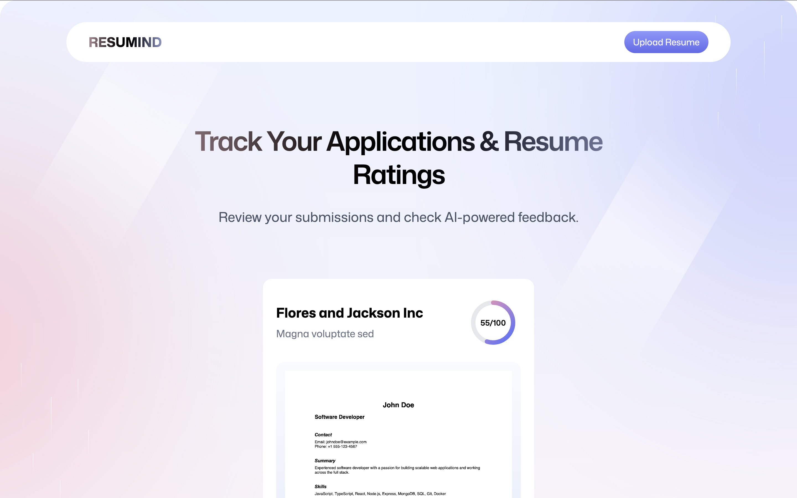

# 📝 Resumind

[](LICENSE)

**Resumind** is a highly responsive web application built with **React**, **Tailwind CSS**, and **React Router v7**. It allows users to upload resumes and receive AI-powered feedback with ATS scoring, helping job seekers optimize their resumes and track applications. The app uses **Puter.js** for storage and state management, and provides a modern, user-friendly interface.

## 🌟 Features

- Upload and analyze resumes in **PDF format**.
- AI-powered feedback and improvement tips.
- ATS score calculation for better resume optimization.
- Track multiple resume submissions.
- Highly responsive design for mobile and desktop.
- Seamless navigation using **React Router v7**.
- Uses **Puter.js** for local storage, file handling, and state management.
- Notifications using **Sonner**.
- PDF to Image conversion for previews.

## 📸 Screenshots




## 🛠️ Tech Stack

- **Frontend:** React, Tailwind CSS
- **Routing:** React Router v7
- **State & Storage:** Puter.js
- **AI Feedback:** Custom AI API integration
- **Other Libraries:** Sonner (notifications), PDF-to-image conversion
- **Build Tools:** Vite

## 🚀 Getting Started

### Prerequisites

- Node.js >= 18
- npm or yarn

### Installation

```bash
# Clone the repository
git clone https://github.com/Ahmed-HA-RE/ai-resume-analyzer.git
cd resumind

# Install dependencies
npm install
# or
yarn install

# Start development server
npm run dev
# or
yarn dev

```

## 💡 Usage

- Go to the Upload Resume page.
- Fill in:
  • **_Company Name_**
  • **_Job Title_**
  • **_Job Description_**
- Upload your PDF resume.
- Click Analyze Resume.
- View AI feedback, ATS score, and suggestions.
- Track all your submissions on the Home Page.

## ⚡ Notes

- Resumes must be in PDF format for proper conversion.
- AI feedback works best with detailed job descriptions.
- Modern browsers recommended for best experience.
- All state and storage are managed using Puter.js.

## 🔗 Links

- Website: [resumind.ahmedrehandev.net]()
- Author: Ahmed Haitham Rehan
